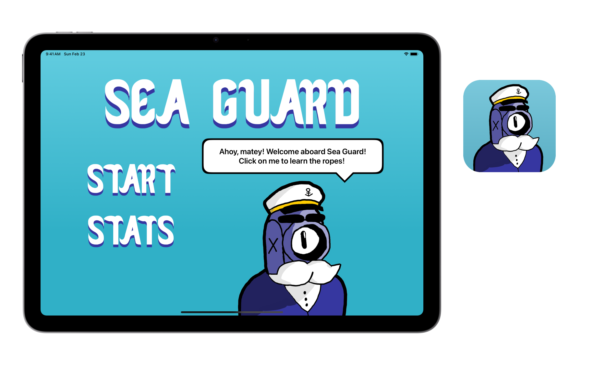

# Sea Guard

_Ocean Cleaning Game. Get to work sailor!_

## Features
- [x] Save the ocean from ocean pollution!
- [x] Guide the ship before the battery depletes
- [x] Pick up bottles, bags and cans from the sea
- [x] Control the ship by tilting the device
- [x] Pick up boat upgrades to reach higher scores
- [x] Analyze your runs with statistics
- [x] Reach new high scores!

## Requirements
- iOS 16.0+
- SwiftPlaygrounds 4.5+

## Frameworks
- SwiftUI
- SpriteKit
- CoreMotion
